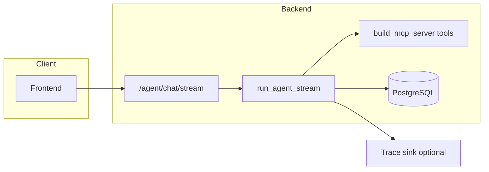

# Agent evaluation and observability implementation plan

## Current integration points (facts from the repo)

- The agent entrypoint is [`run_agent_stream`](backend/app/agent/loop.py) → consumed by [`POST /agent/chat/stream`](backend/app/main.py) (auth required via `require_auth`).
- The loop already emits structured phases you can record: `tool_call_start` (name + args), `tool_result`, `text_delta`, `done` / `error`. It persists messages via [`chat_storage`](backend/app/agent/chat_storage.py).
- Production stack: FastAPI + PostgreSQL ([`DATABASE_URL`](backend/app/database.py)), Railway starts with [`uvicorn app.main:app`](backend/railway.toml). No Dockerfiles in-repo (Nixpacks).

---

## 1. Framework choices (recommended stack)

| Concern | Recommendation | Why |
|--------|----------------|-----|
| **Unit / deterministic tests** | Stay on **pytest** (already in [`backend/requirements.txt`](backend/requirements.txt)) | No new dependency; test tools, seed builders, executor paths without LLM. |
| **Offline agent eval (dataset + runner)** | **Phase 1: custom Python package** under `backend/evals/` (JSON/YAML cases + asyncio consumer of SSE-like events) | Full control over rubrics, DB assertions, and `pass@N` without vendor lock-in. |
| **Trace storage + dashboards** | **Phase 2: Langfuse** (Python SDK `langfuse`) *or* **Braintrust** | Both support experiments, scores, and production tracing; pick one to avoid duplicating instrumentation. **Langfuse** is a common single pane for dev eval + prod if you self-host or use cloud. |
| **APM / infra metrics** | **Railway built-in metrics** + optional **OpenTelemetry** (`opentelemetry-api`, `opentelemetry-sdk`, `opentelemetry-exporter-otlp`) | Railway gives CPU/RAM/restarts; OTLP exports FastAPI request latency to Grafana Cloud / Honeycomb / Datadog if you need p95 on routes. |

**Avoid** wiring a second full framework (e.g. LangSmith + Langfuse) unless you need a specific feature; one trace backend is enough.

---

## 2. Code layout and files to add

### 2a. Trace model and instrumentation (production + eval)

- **New** [`backend/app/agent/trace_context.py`](backend/app/agent/trace_context.py) (or `observability.py`):
  - `generate_trace_id() -> str` (UUID).
  - Optional `TraceContext` dataclass: `trace_id`, `session_id`, `user_id`, `model`, `started_at`.
- **Edit** [`backend/app/agent/loop.py`](backend/app/agent/loop.py):
  - At start of `run_agent_stream`, create `trace_id`; pass it through to every `sse(...)` payload as `trace_id` (additive field on existing event bodies) **or** add a dedicated first event `trace_start` (choose one pattern and keep it stable for clients).
  - On `tool_call_start` / `tool_result` / terminal `done`/`error`, call a thin `emit_span(trace_ctx, event_type, payload)` that:
    - Logs **structured JSON** (one line per span) via `logger.info` with a dedicated key like `"agent_trace": true` for log drains, **and/or**
    - Calls Langfuse/Braintrust client if env vars are set (no-op if missing).
- **Edit** [`backend/app/main.py`](backend/app/main.py):
  - Optional: FastAPI middleware recording HTTP `request_id`, path, status, duration — correlate with `trace_id` if you add `X-Request-ID` header propagation.

This keeps observability **orthogonal** to business logic: the loop stays readable; sinks are swappable.

### 2b. Offline eval harness (not default pytest unless marked slow)

- **New directory** `backend/evals/`:
  - `cases/*.yaml` — one file per scenario (or one `cases.jsonl`):
    - `id`, `user_message`, optional `session_seed` (prior turns).
    - `fixture`: reference to a **pinned DB snapshot** (see below).
    - `expect`: list of checks, e.g. `tool_called: mcp__staffing__get_availability`, `tool_not_called: ...`, `max_tool_calls: 20`, `response_contains: [...]`, `db_assertions` (SQL or high-level helpers).
    - `runs: 5` for `pass@k`-style statistics.
  - `runner.py` — async:
    - Load fixture DB (transaction rollback or temp DB — see §3).
    - Build `AgentRequest` matching [`AgentRequest`](backend/app/agent/models.py) (verify field names).
    - Call `run_agent_stream(...)` and **parse SSE** the same way the frontend does (reuse or duplicate minimal parser in `evals/sse_parse.py`).
    - Aggregate tool names in order; run `expect` checks; output **JSON report** (per case: pass/fail, scores, tool trace, stderr tail).
  - `stats.py` — compute pass rate, per-metric rates, Wilson CI optional.

### 2c. Pinned world state (your `store.json` question)

- **New** `backend/evals/fixtures/`:
  - Commit small **exports** via existing [`import_full_json`](backend/app/main.py) / [`storage.import_full_json`](backend/app/storage.py) path, or a **minimal JSON** subset that only contains rows needed for the case.
- **Runner setup**:
  - For isolation: use a **dedicated PostgreSQL database** (e.g. `postgresql:///staffing_eval`) in CI/local, run `Base.metadata.create_all`, `seed` or import fixture, run case, **drop schema or truncate** between cases — or wrap in a transaction with rollback if all code paths use the same session (agent uses `Session` from caller; ensure runner uses one session per case and rolls back if feasible).

### 2d. Pytest integration

- **New** [`backend/tests/test_agent_eval_smoke.py`](backend/tests/test_agent_eval_smoke.py) (example name):
  - `@pytest.mark.slow` + `@pytest.mark.skipif(not os.getenv("RUN_AGENT_EVAL"))` — runs **one** tiny mocked or live case so CI stays fast by default.
- Keep [`backend/tests/test_seed.py`](backend/tests/test_seed.py) as-is for seed integrity.

### 2e. Optional: admin-only or CI-only eval HTTP endpoint (only if needed)

- If CLI runner is enough, **skip** HTTP. If you need Railway to trigger evals:
  - **New** route `POST /internal/eval/run` guarded by `require_admin` **and** `EVAL_API_KEY` header — returns report JSON. Prefer **not** exposing this publicly; better run evals from GitHub Actions with SSH or a private worker.

---

## 3. Functions to implement (concise checklist)

| Module | Function / responsibility |
|--------|---------------------------|
| `trace_context.py` | `generate_trace_id`, optional Langfuse span wrappers |
| `loop.py` | Inject `trace_id`; call `emit_span` on tool events and completion |
| `evals/runner.py` | `load_case`, `apply_fixture`, `consume_run_agent_stream`, `assert_expectations`, `main()` CLI |
| `evals/sse_parse.py` | Parse `text/event-stream` chunks from async generator (mirror client) |
| `storage` or eval helper | `load_eval_fixture(db, path)` wrapping `import_full_json` |

---

## 4. Scoring and non-determinism (concrete)

- Store per check: `name`, `passed: bool`, `weight` (default 1).
- **Case score** = weighted sum / total weights.
- **Run-level**: repeat `runs` times; report `pass_rate`, `mean_score`, optional `pass@k` (success if any run passes).
- Optional **LLM judge**: separate step calling Anthropic with a fixed rubric — only for checks you cannot encode (keep behind flag; costs money).

---

## 5. What to set up on Railway and elsewhere

### Railway (backend service)

- **PostgreSQL** plugin: attach to backend; Railway injects `DATABASE_URL` (verify SQLAlchemy accepts the URL; sometimes needs `postgresql+psycopg2://` — align with [`database.py`](backend/app/database.py)).
- **Environment variables** (minimum):
  - `ANTHROPIC_API_KEY` — required for agent.
  - `ADMIN_USERNAME` / `ADMIN_PASSWORD` (if you use bootstrap admin from [`bootstrap_admin`](backend/app/main.py)).
  - `AGENT_WORKSPACE_DIR` — optional; [`_ensure_claude_cwd`](backend/app/agent/loop.py) defaults to temp dir + git init.
  - `TAVILY_API_KEY` — optional for web search MCP.
  - CORS: currently `allow_origins=["*"]` in [`main.py`](backend/app/main.py); for production you may restrict to your frontend URL.
- **Observability**: Railway logs are enough for Phase 1 structured JSON. Add **log retention** awareness (free tier limits).

### Langfuse (if Phase 2)

- **Option A — Langfuse Cloud**: create project → copy `LANGFUSE_PUBLIC_KEY`, `LANGFUSE_SECRET_KEY`, `LANGFUSE_HOST`.
- **Option B — Self-host Langfuse**: deploy their Docker stack on a small VPS or second Railway service; point `LANGFUSE_HOST` to it.
- Set the same vars on Railway for the backend so `emit_span` can flush traces.

### CI (recommended for eval jobs, not Railway)

- **GitHub Actions** (or similar): workflow on `schedule` + `workflow_dispatch`:
  - Job services: PostgreSQL container.
  - Secrets: `ANTHROPIC_API_KEY`, optional Langfuse keys.
  - Steps: `pip install -r requirements.txt`, run `pytest`, run `python -m evals.runner --all` with `RUN_AGENT_EVAL=1`.
- **Why not Railway cron for heavy eval**: avoids coupling load and cost to production; keeps API keys scoped to CI.

### Frontend (existing [`frontend/railway.toml`](frontend/railway.toml))

- Point API base URL to backend URL; no change to eval design unless you surface trace IDs in UI for debugging.

---

## 6. Rollout order (minimize risk)

1. **Structured trace logging** in `loop.py` + log-based metrics (grep/count in Railway logs).
2. **Eval harness** with 3–5 cases from your exported conversations (tool must-haves, clarification behavior).
3. **Optional Langfuse** once JSON reports are stable.
4. **CI workflow** for nightly eval; PR gate only for cheap checks or `pass@1` on a micro subset.

---

## 7. Security notes

- Eval runner must use a **test user** or service account — same as [`require_auth`](backend/app/auth.py) for `/agent/chat/stream`.
- Never commit real API keys; use CI secrets and Railway variables.
- If you add `/internal/eval`, protect with admin + secret and disable in production unless needed.
