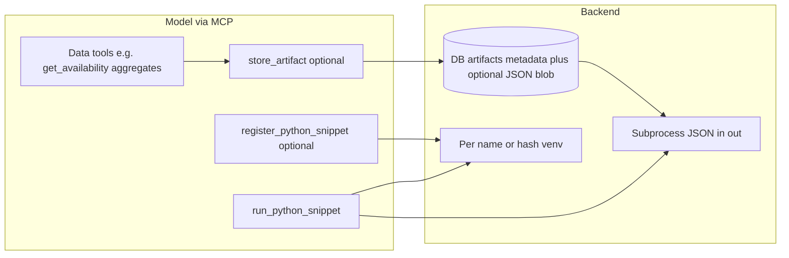
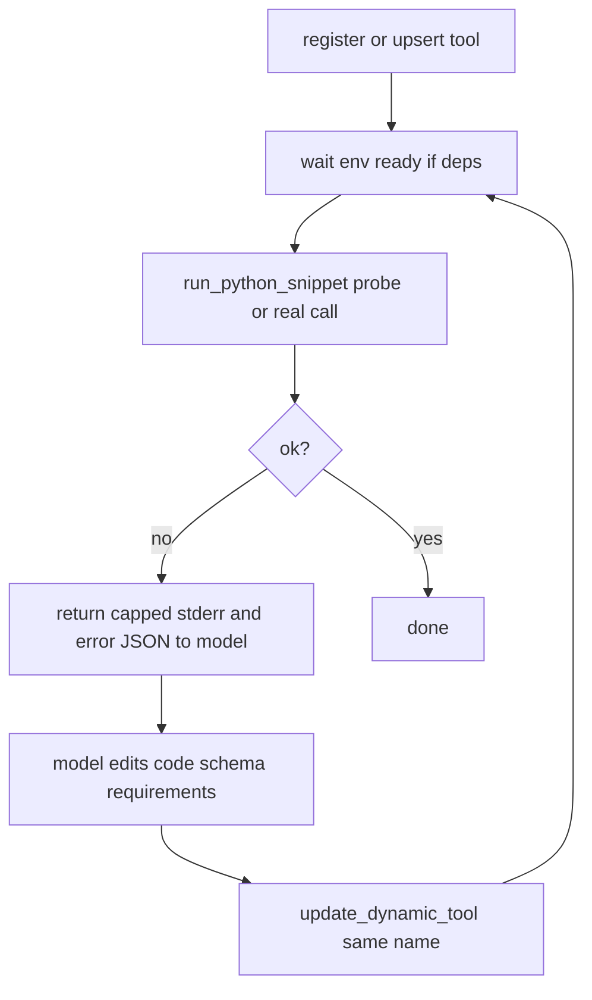

# Python runner, artifacts, and data contracts

## Purpose

Capture the agreed design for letting the **staffing backend** execute **agent-authored Python** (e.g. matplotlib plots) in a **dedicated venv** with **declared dependencies**, without relying on **Claude Code Bash**. Execution is always **`subprocess` + that venv’s `python`** inside the API process.

This doc is **additive** to [`.claude/plans/dynamic-tool-generation.md`](dynamic-tool-generation.md): same mechanical ideas (per-unit venv, sandbox runner, JSON boundary), but emphasizes **how data reaches the runner** (no large conversation payloads), **ephemeral artifacts** (`artifact_id`), and an **agent feedback loop** (try → analyze error → update → override registry).

Reference implementations for subprocess/venv patterns exist in the sibling `staffing` repo (`backend/app/agent/sandbox.py`, `dynamic_tools.py`) — use as **reference**, not a verbatim port; this repo may already have ORM pieces ([`backend/app/orm_models.py`](../../backend/app/orm_models.py) includes `DynamicToolORM`).

---

## Problem being solved

| Issue | Approach |
|-------|----------|
| Claude Code **don’t-ask mode** blocks **Bash** | Run Python only on the **server** via MCP tools; model never invokes shell. |
| **matplotlib** (etc.) not in app `requirements.txt` | **Per-snippet / per-named-tool venv** with `pip install` of declared packages (background install acceptable). |
| Agent pasting **large datasets** into chat | **Small JSON-schema inputs**; fetch/transform via existing tools; optional **`artifact_id`** for larger-but-still-bounded payloads stored server-side. |

---

## High-level architecture

---

## Agent feedback loop: try, analyze, update, override

The agent should **not** stop at registration. The intended workflow is:

1. **Register** (or **replace**) the snippet in the **tool registry** (DB row keyed by tool name, MCP exposure of that name).
2. **Probe run:** Call **`run_*`** with **small fixture args** (or a **dry-run** mode if you add one) so failures surface **before** the user relies on the tool. If a probe is too heavy, at minimum run once with **real** minimal inputs right after `env_status == ready`.
3. **On failure:** Return **structured, bounded errors** to the model — e.g. `stderr` tail (capped), exception message, `env_status` / `pip` failure string — not opaque “internal error.”
4. **Analyze and fix:** The model updates **code**, **`parameters_schema`**, and/or **`requirements`**, then calls **`update_dynamic_tool`** (or **`create_*` with upsert semantics**) to **override** the same registry entry **by name**:
   - Replace stored **code** and **schema** atomically.
   - If **`requirements`** changed: mark `env_status` **pending**, **recreate or update** the per-tool venv (background `pip`), block or retry `run` until **ready** (same as first-time install).
   - If only **code** changed: no reinstall; optionally bump a **`code_revision`** for debugging.
5. **Repeat** register/run until success or a **max iteration** / user-visible cap (implementation detail).

**System prompt / tool docs:** Instruct the agent to **always** attempt at least one **run** after creating or changing a tool, and to use **`update_*`** to **override** the registry rather than inventing a second name unless intentional.

---

## Execution model

- **Boundary:** User/agent code defines a **named function**; the runner wraps it, passes **`json.loads`** args (from argv or stdin), prints **single JSON line** `{ "ok": bool, "result" | "error": ... }` (or structured image payload — see below).
- **Venv:** One **persistent venv per logical registration** (e.g. tool name) is preferred for repeated plots; **ephemeral venv keyed by hash** of `(requirements, code)` is an alternative for one-offs (cold-start cost vs isolation).
- **Dependencies:** Declared list (e.g. `["matplotlib"]`); **install in background thread** so the event loop is not blocked; surface `env_status: pending | ready | failed` like the reference `dynamic_tools` pattern.
- **Environment for child process:** Minimal `env` (PATH, HOME, locale, optional `LD_*` if needed on Nix) — **no app secrets**.

---

## Data contracts (no large context)

1. **Preferred:** First-class **aggregate** tools return **exactly** the small shape the plot function needs (e.g. weekly series for DS team — tens of rows, not full raw availability dumps).
2. **Registration:** Each snippet exposes an **input JSON Schema** (max size / max array length enforced at validation).
3. **Optional transform:** Agent may register or call a **pure transform** from tool output shape → plot input shape (second snippet or inlined step).
4. **Outputs:** Constrain to **JSON-serializable** results or **`{ "type": "png_base64" }` / `svg` string** — not raw megabyte prints.

---

## `artifact_id` semantics

**Storage (default recommendation)**

- **Primary:** **Database row** — `artifact_id` (UUID), `created_at`, **`session_id` or `user_id`**, `content_type`, `byte_size`, **`payload_json`** (TEXT/JSONB) for small/medium aggregates.
- **Large blobs:** If needed later, store **filesystem or object storage** but keep **pointer + metadata in DB**; resolve by `artifact_id` only inside the server.

**Why not filesystem-only:** Multi-instance deploys, backups, and cleanup are harder without DB as source of truth.

**One-off and TTL**

- Treat one-off artifacts as **ephemeral**: **TTL** (e.g. 15–60 minutes) and/or **delete at session end**.
- **After successful `run_*`:** Optional **immediate delete** when the run was flagged one-off.
- **Failed runs:** Short retention for retry, then TTL.
- **Always:** **Max size** at write time; reject oversized payloads.

**Authorization:** Load artifact only if `artifact_id` belongs to the **same user/session** as the request.

---

## Agent workflow (happy path)

1. Call existing tools to get **aggregated** data (or call `store_artifact` with compact JSON if the pipeline requires a second step).
2. **Register or upsert** snippet + requirements + input schema; wait until `env_status == ready` when deps exist.
3. **Run** (`run_python_snippet`) with **small args** and optionally `artifact_id` — include an initial **probe** or **smoke run** when practical.
4. **If error:** read returned error payload, **update** tool via **override** (same name), adjust venv if requirements changed, **run again**.
5. Return chart reference to UI (base64 URL or stored file id) per product needs.

---

## Safety

- Code size cap; **AST** validation; required **function name**; optional **import allowlist**.
- **Subprocess timeout**; cap stdout; no arbitrary network unless explicitly allowed.

---

## Relation to existing plan and code

- **[`dynamic-tool-generation.md`](dynamic-tool-generation.md):** Describes DB-backed dynamic tools, venv layout, startup recovery — **reuse concepts** where this repo implements them.
- **This repo:** `DynamicToolORM` already exists in [`orm_models.py`](../../backend/app/orm_models.py); implementation work should **extend executor/tools/sandbox** rather than duplicate the plan file blindly.
- **New in this design:** **`Artifact` model + tools** (`store_artifact`, TTL), **strict schema-first** data flow for plot inputs, and **upsert + probe run + structured errors** so the agent can fix tools in place.

---

## Suggested implementation phases (when you implement)

1. **Artifact ORM + `store_artifact` / internal load by id** (scoped to user/session, TTL job or delete-on-read).
2. **Sandbox runner** (subprocess + JSON) + **venv manager** if not present.
3. **Register / run / update (upsert)** MCP tools wired in [`backend/app/agent/tools.py`](../../backend/app/agent/tools.py) + [`backend/app/agent/executor.py`](../../backend/app/agent/executor.py): **`update_dynamic_tool`** (or **`create_*` idempotent by name**) so the agent can **override** the registry without orphan rows.
4. **Error surface:** Runner returns **structured JSON** with capped `stderr`, exception type/message, and `env_status` when relevant.
5. **Prompting:** System or tool description tells the agent to **run after register**, **iterate on failure**, and **upsert** rather than duplicate names.
6. **One aggregate data tool** for the DS weekly plot case to validate the pipeline without large context.

---

## Non-goals (for this design)

- Running arbitrary shell in Claude Code.
- Passing unbounded raw tables through the model; **artifacts** are for **bounded**, **validated** server-side payloads only.
